<!-- profile README: github.com/SKRIZIdev -->


### `> about`

18 y/o backend developer. I build services at an IT company: backends, automation and LLM-powered tools.
I write code by hand and run teams of AI agents — I split the work, review what they ship and own the result.

### `> stack`


### `> work`

| Project | What it does | Stack |
|---|---|---|
| **SEO Audit Service** | Crawls a site, runs 181 checks in 10 blocks, an LLM writes the findings, a Google Docs report comes out. 1,790 tests, team project | Python · FastAPI · SQLite · LLM |
| [**AI Tools Lens**](https://github.com/SKRIZIdev/ai-tools-lens) | Japanese review site: 11 AI image generators on 8 criteria, every fact checked against official pages. [Live](https://aitoolslens.com) | Python · JS · Cloudflare Pages |
| **Knowledge Base** | Collects product facts from websites and public profiles, tracks changes between runs, turns them into edit tasks. 1,274 tests | Node.js · SQLite · LLM |
| **Multi-agent site factory** | ~170 AI agents built 13 content sites in one run; the engine ran 9,018 automated checks | Python · agent orchestration |

### `> side projects`

| Project | What it does | Stack |
|---|---|---|
| [**Tickrly**](https://github.com/SKRIZIdev/tickrly) | Telegram bot: crypto prices with candle charts, alerts, portfolio, market heatmap | Python · aiogram · PostgreSQL |
| [**claude-usage-widget**](https://github.com/SKRIZIdev/claude-usage-widget) | macOS desktop widget: Claude Code usage for the 5-hour and weekly windows | Python · JSX |
| [**Pole Barn Cost**](https://github.com/SKRIZIdev/polebarncost) · [**Acre Journal**](https://github.com/SKRIZIdev/acrejournal) | Static sites for the US market: building costs, farm equipment | Python static generator |
| [**Cool Cat Kit**](https://github.com/SKRIZIdev/notebook-for-u-kitty) | Cat diary web app with JWT auth | JS · FastAPI · PostgreSQL · Docker |

```text
since May 2026:  1,700+ commits  ·  3,900+ tests  ·  38 repositories
```
